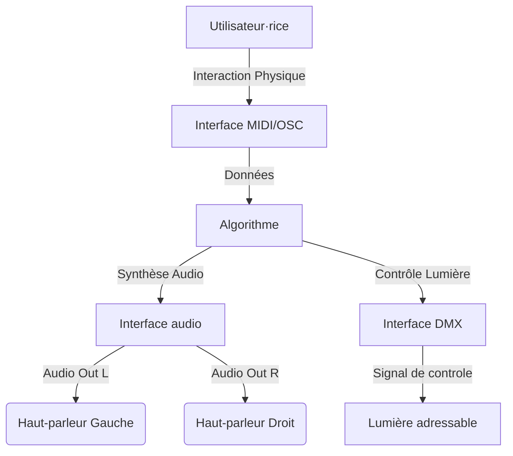

# Audio 2.0 : deux Haut-Parleurs, une lumière, une interactivité

## Description 

Brancher et déployer une installation qui combine une lumière adressable à une sonorisation stéréo (deux haut-parleurs) et une interaction. L'ensemble produit un son lorsque l'interaction est activée.

L'objectif principal est de développer la capacité à brancher et intégrer efficacement les éléments techniques pour créer des interactions pertinentes et innovantes. 

C'est une exploration pratique autour d'une lumière, deux haut-parleurs et une interactivité bien pensée qui peuvent transformer une installation en une expérience immersive et engageante.

## Objectifs pédagogiques

### Branchements

* Connecter efficacement les éléments audio nécessaires pour spatialiser le son.
* Maîtriser le branchement d'une installation spatialisant le son stéréo

### Communications

* Utiliser un protocoles de communication en temps réel pour influencer le son (OSC, CV, MIDI)
* Comprendre et appliquer les protocoles OSC, CV et MIDI pour créer des interactions sonores dynamiques.

### Spatialisation

* Positionner les haut-parleurs de manière optimale dans une installation spatialisant le son :**
* Apprendre les techniques de placement des haut-parleurs pour enrichir l'expérience auditive.

## Livrable

Le livrable est une présentation de l'installation comprenant une lumière adressable  deux haut-parleurs et une composantes activable.

### Installation stéréo, lumière, interaction 

* Sélectionner et adapter des médias sonores pour une spatialisation efficace et une qualité optimale.
* Contrôler la qualité du produit multimédia 
* Assurer la fiabilité et la performance de l'installation.
* Créativité et interactivité pertinente 
* Intégration d'éléments sonores et lumineux une expérience immersive.
* Présentation professionnelle du produit multimédia et des concepts explorés

## À communiquer

* Démontrer l'installation en fonctionnement 
  * Présenter le résultat 
  * Mettre en évidence l'interaction entre le son et la lumière, ainsi que l'interactivité créée.

* Expliquer les concepts explorés 
  * Détailler les protocoles de communication utilisés (OSC, CV, MIDI) et leur application dans le projet.
  * Illustrer le processus de branchement et de positionnement des éléments pour la spatialisation sonore.
  * Décrire l'intégration et l'optimisation des médias utilisés.

* Justifier sa contribution personnelle 
  * Exposer clairement son rôle au sein de l'équipe et les tâches spécifiques accomplies.
  * Argumenter les choix techniques et créatifs effectués, en expliquant en quoi ils enrichissent l'installation.

## Schema exemple

