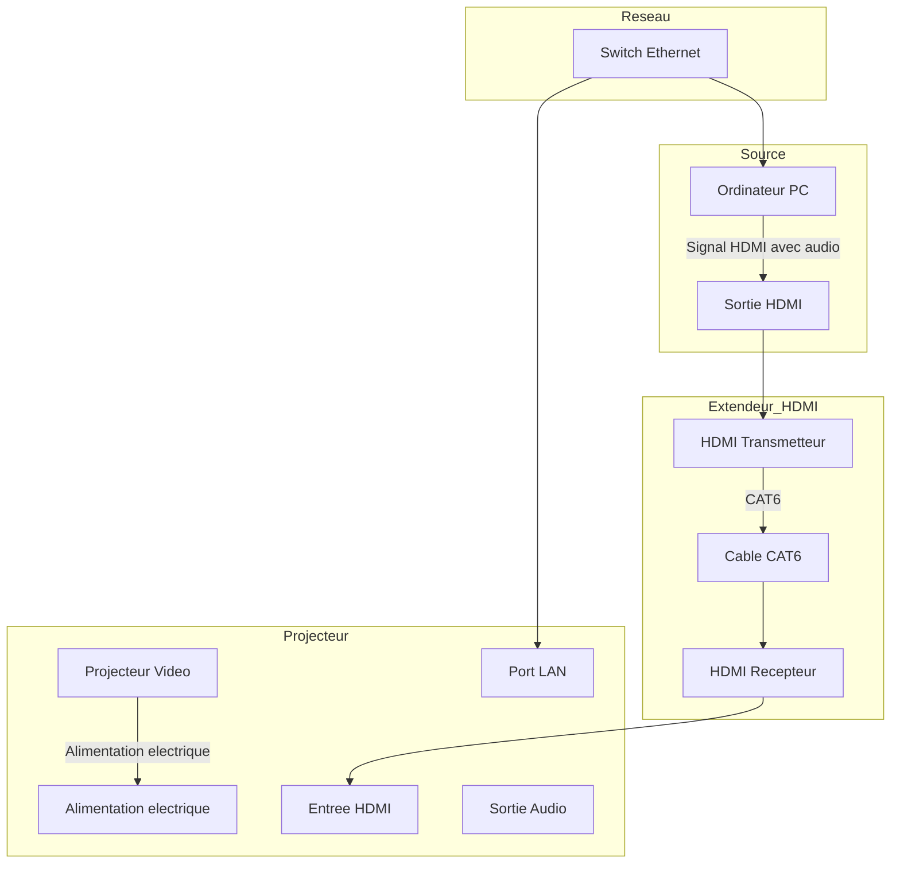

# Vidéo

## Matière à couvrir 

* Branchement d’une installation de projection architecturale
* Emploi de protocoles pour transporter la vidéo en temps réel
* Logiciels d'intégration multimédia spécialisés en projection architecturale
* Intégration de médias pour la projection vidéo architecturale
* Optimisation des médias pour la projection vidéo architecturale
* Contrôle de la qualité du produit multimédia
* Archivage du produit multimédia

## Brancher un projecteur

