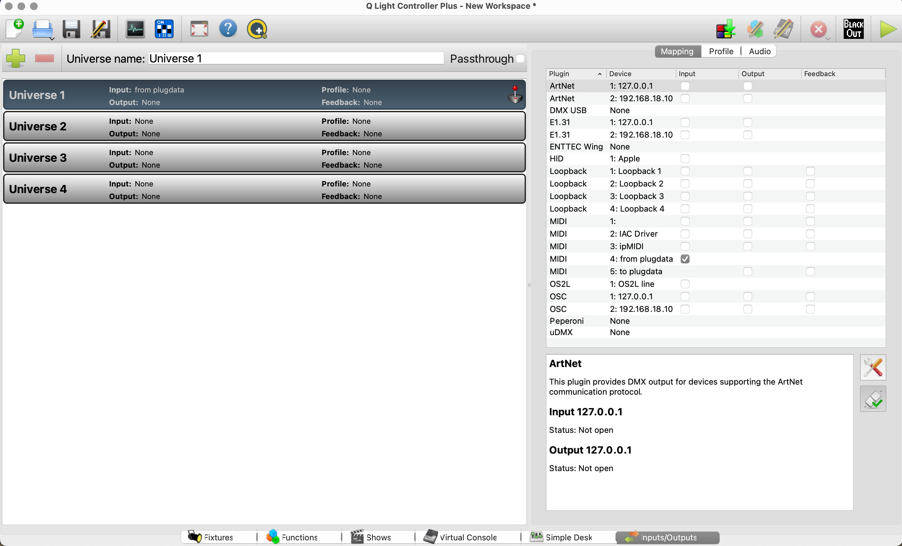
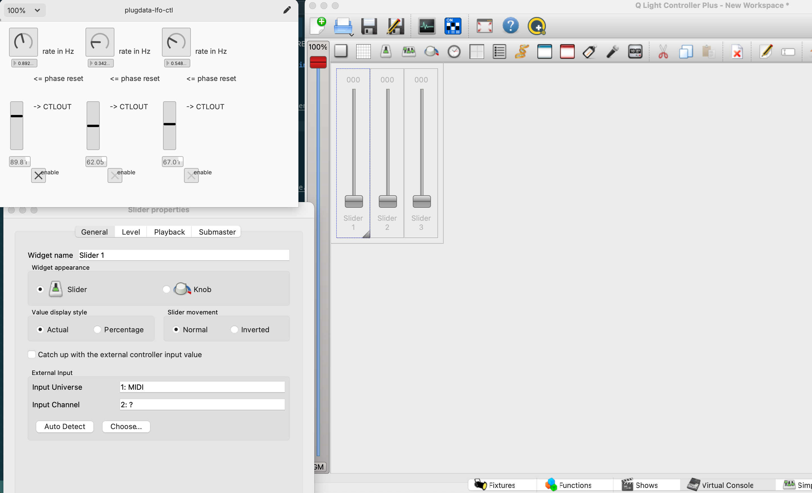

# Midi Map

## QLC midi mapping

### Spécifique à Windows 

#### Drivers Midi Virtuel

* Utiliser [loopmidi](https://www.tobias-erichsen.de/software/loopmidi.html)

* Démarrer loop midi 

### Plugdata 

* [Plugdata](https://plugdata.org/)

### Config 

#### Entrée midi

#### midi mapping 

#### github absolue

[Patch Plugdata LFO](https://raw.githubusercontent.com/tim-montmorency/582513-conception/main/activites/lx_midi_map/plugdata-lfo-ctl.pd.zip) 

[Patch Plugdata Analyse](https://raw.githubusercontent.com/tim-montmorency/582513-conception/main/activites/lx_midi_map/analyse_audio.pd.zip) 

### Reaper

#### Télécharger

* [link absolue avec ignore](/activites/lx_midi_map/analyse_audio.pd ':ignore')

