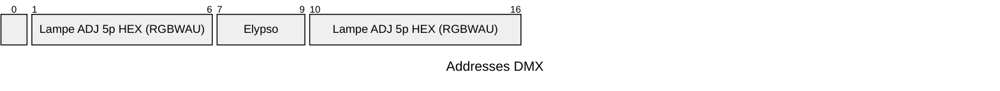
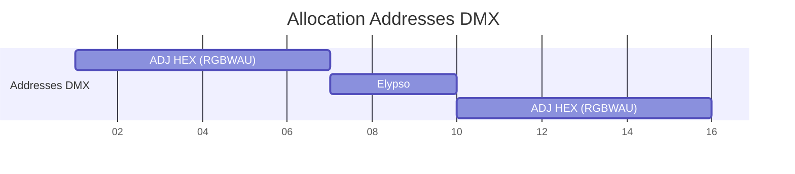

# Addresses

Voici des méthode pour représenter visuellement les addresses des lampes 

## Mermaid packet-beta

```mermaid
---
title: "Addresses DMX "
---
packet-beta
0: "" %% packet-beta doit partir à 0 
1-6: "Lampe ADJ 5p HEX (RGBWAU)"
7-9: "Elypso"
10-16: "Lampe ADJ 5p HEX (RGBWAU)"

```

## Via mermaid gantt

```mermaid
gantt
    title Allocation Addresses DMX
    axisFormat  %y

    section Addresses DMX
    ADJ HEX   (RGBWAU)   : 0001, 6y
    Elypso    : 0007, 3y
    ADJ HEX  (RGBWAU)    : 0010, 6y

```