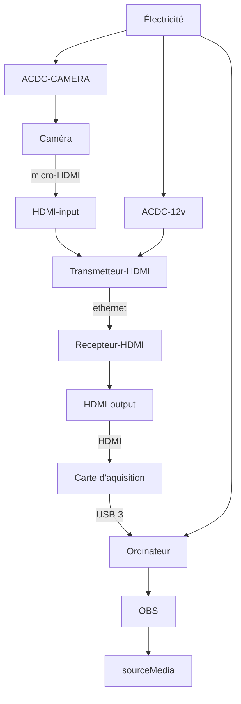

# Vidéo extention et captation

```mermaid
graph TD
Caméra --micro-HDMI--> HDMI-input--> Transmetteur-HDMI --ethernet--> Recepteur-HDMI --> HDMI-output -- HDMI-->  carte[Carte d'aquisition] --USB-3--> Ordinateur --> OBS --> sourceMedia

Électricité --> ACDC-CAMERA-->Caméra
Électricité --> ACDC-12v-->Transmetteur-HDMI
Électricité --> Ordinateur
```