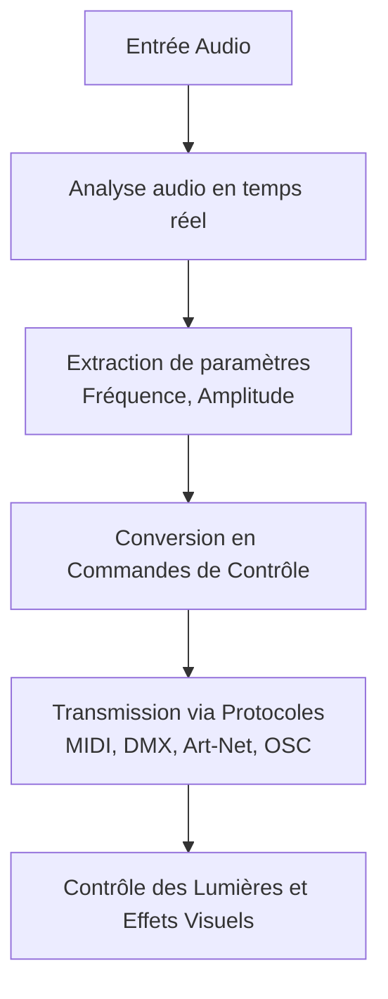

# Analyse Audio en Temps Réel 

## Quand le Son Contrôle la Lumière

Dans le monde en constante évolution du multimédia, l'intégration harmonieuse entre le son et la lumière est devenue un élément clé pour créer des expériences immersives. L'analyse audio en temps réel permet désormais de traduire les nuances sonores en effets visuels dynamiques, ouvrant de nouvelles perspectives pour les intégrateurs multimédia.

## L'essence de l'Analyse Audio en Temps Réel

L'analyse audio en temps réel consiste à capturer et à interpréter instantanément les caractéristiques du signal sonore, telles que la fréquence, l'amplitude et le rythme. Grâce à des algorithmes sophistiqués, ces données peuvent être converties en commandes pour contrôler d'autres paramètres, comme l'éclairage, en synchronisation parfaite avec le son.

## Applications pratiques dans l'éclairage

### Éclairage réactif 

En utilisant les fréquences basses pour contrôler l'intensité lumineuse et les hautes fréquences pour changer les couleurs, on peut créer des ambiances qui évoluent au rythme de la musique.

### Mapping vidéo dynamique

Les projections peuvent être modifiées en temps réel en fonction des variations sonores, offrant une expérience visuelle unique à chaque performance.

### Scénarios interactifs 

Dans les installations artistiques ou les événements, le public peut influencer l'environnement sonore, qui à son tour modifie l'éclairage, créant une boucle d'interaction engageante.

## Technologies Clés pour les Intégrateurs Multimédia

### Logiciels d'Analyse

Des outils comme Max/MSP, TouchDesigner, PlugData ou Ableton Live avec des plugins spécifiques permettent une analyse audio avancée et une intégration avec les systèmes d'éclairage.

### Protocoles de Communication

L'utilisation de protocoles tels que DMX, Art-Net, MIDI ou OSC assure une transmission fluide des données entre les dispositifs audio et lumineux.

### Matériel Adapté

Des contrôleurs et interfaces capables de gérer de grandes quantités de données en temps réel sont essentiels pour une performance optimale.

## Avantages de cette intégration

### Expérience Immersive

Une synchronisation parfaite entre le son et la lumière enrichit l'expérience utilisateur, rendant les événements plus mémorables.

### Flexibilité Créative**

Les intégrateurs peuvent explorer de nouvelles formes d'expression artistique en combinant différents médias.

### Efficacité Opérationnelle

Automatiser les effets lumineux en fonction du son réduit la complexité de la gestion manuelle pendant les performances.

## Récapitulatif

L'analyse audio en temps réel et son application à d'autres paramètres comme la lumière représentent une avancée majeure pour le secteur du multimédia. En maîtrisant ces technologies, les intégrateurs peuvent repousser les limites de la créativité et offrir des expériences toujours plus innovantes et captivantes.

## Analyse Audio Multibande dans REAPER via plugdata

https://github.com/gllmAR/pd-Multiband-Audio-Analyzer
