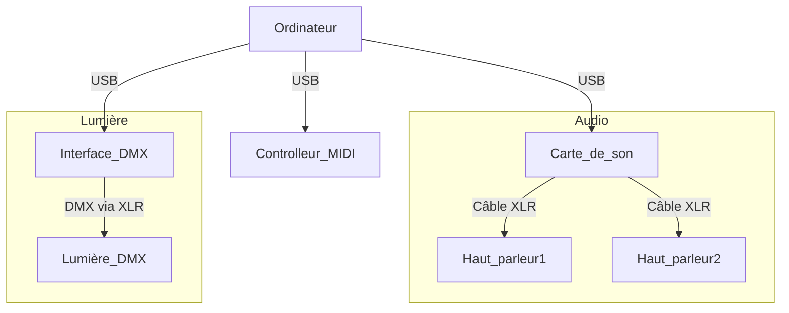
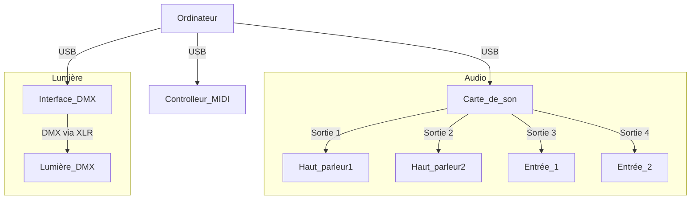

# Branchements

## Simple

```mermaid

graph TD
    Ordinateur -->|USB| Carte_de_son 
    Ordinateur -->|USB| Interface_DMX
    Ordinateur -->|USB| Controlleur_MIDI 

    subgraph Audio
        Carte_de_son
        Carte_de_son -->|Câble XLR| Haut_parleur1
        Carte_de_son -->|Câble XLR| Haut_parleur2
    end

    subgraph Lumière
        Interface_DMX --> |DMX via XLR| Lumière_DMX
    end

```

## Loopback physique

```mermaid

graph TD
    Ordinateur -->|USB| Carte_de_son 
    Ordinateur -->|USB| Interface_DMX
    Ordinateur -->|USB| Controlleur_MIDI 

    subgraph Audio
        Carte_de_son
        Carte_de_son -->|Sortie 1| Haut_parleur1
        Carte_de_son -->|Sortie 2| Haut_parleur2
        Carte_de_son -->|Sortie 3| Entrée_1 
        Carte_de_son -->|Sortie 4| Entrée_2
    end

    subgraph Lumière
        Interface_DMX --> |DMX via XLR| Lumière_DMX
    end

```