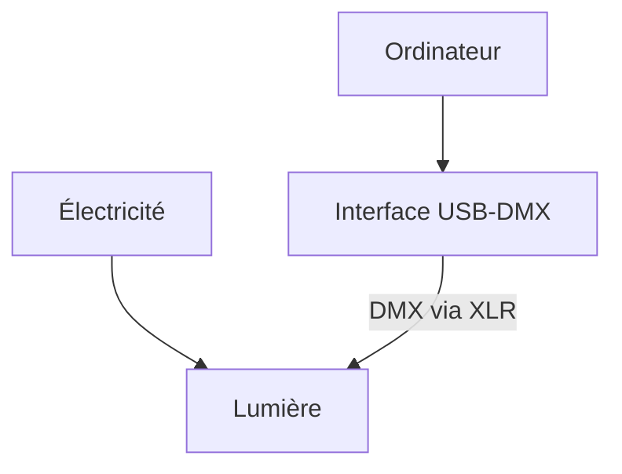
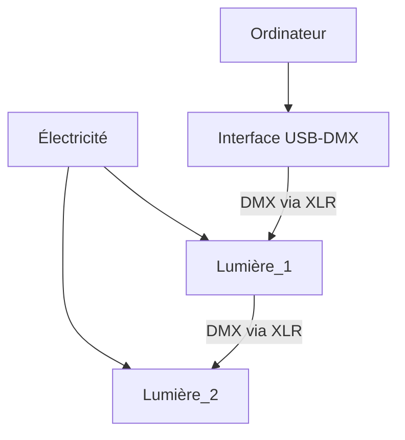

## Branchement d’une installation de lumières scéniques

### Simple

### Plusieurs

## Emploi des protocoles de communication pour lumières scéniques

## Manipulation des intensités lumineuses grâce à un logiciel d'intégration multimédia

## Réalisation d’une composition de lumières scéniques

## Intégration des médias pour une composition de lumières scéniques

## Optimisation des médias pour une composition de lumières scéniques

## Contrôle de la qualité du produit multimédia

## Documentation du produit multimédia